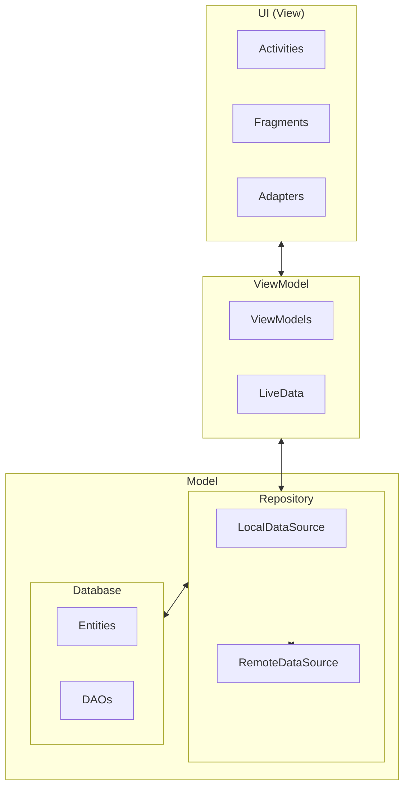
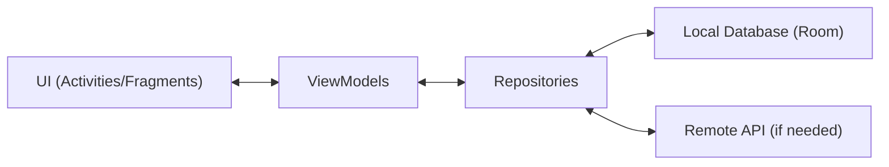
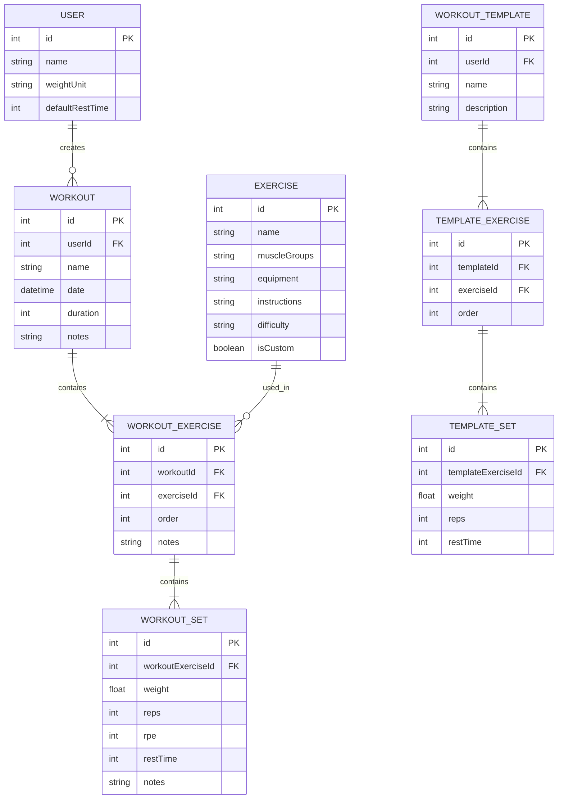

# System Patterns for LiftStrong

## System Architecture

LiftStrong will follow the MVVM (Model-View-ViewModel) architecture pattern, which is recommended for Android applications. This architecture provides a clean separation of concerns and makes the codebase more maintainable, testable, and scalable.

## Key Technical Decisions

1. **Local-First Data Storage**: The app will primarily store data locally using Room Persistence Library, ensuring that users can access their workout data even without an internet connection.

2. **Reactive Programming**: The app will use LiveData and Flow for reactive programming, allowing the UI to automatically update when the underlying data changes.

3. **Single Activity, Multiple Fragments**: The app will follow the single-activity architecture with multiple fragments, using the Navigation Component to manage navigation between screens.

4. **Repository Pattern**: Data access will be abstracted through repositories, providing a clean API for the ViewModels and hiding the complexity of data operations.

5. **Dependency Injection**: Hilt will be used for dependency injection, making the codebase more modular and testable.

## Design Patterns in Use

1. **Repository Pattern**: Centralizes data operations and provides a clean API to the rest of the app.

2. **Factory Pattern**: Used for creating complex objects, such as database instances or API clients.

3. **Observer Pattern**: Implemented through LiveData and Flow, allowing the UI to react to data changes.

4. **Adapter Pattern**: Used in RecyclerViews to display lists of data.

5. **Builder Pattern**: Used for creating complex objects with many optional parameters, such as workout templates.

6. **Singleton Pattern**: Used for objects that should have only one instance throughout the app, such as the database.

## Component Relationships

### Data Flow

### Key Components

1. **Exercise Module**:
   - ExerciseEntity: Database entity representing an exercise
   - ExerciseDao: Data access object for exercises
   - ExerciseRepository: Repository for exercise operations
   - ExerciseViewModel: ViewModel for exercise-related UI

2. **Workout Module**:
   - WorkoutEntity: Database entity representing a workout
   - WorkoutExerciseEntity: Database entity representing an exercise in a workout
   - WorkoutSetEntity: Database entity representing a set in a workout exercise
   - WorkoutDao: Data access object for workouts
   - WorkoutRepository: Repository for workout operations
   - WorkoutViewModel: ViewModel for workout-related UI

3. **Progress Module**:
   - ProgressViewModel: ViewModel for progress-related UI
   - ProgressRepository: Repository for progress calculations

4. **User Module**:
   - UserEntity: Database entity representing user settings
   - UserDao: Data access object for user settings
   - UserRepository: Repository for user operations
   - UserViewModel: ViewModel for user-related UI

### Database Schema

This architecture and these design patterns will provide a solid foundation for the LiftStrong app, ensuring that it is maintainable, testable, and scalable as new features are added.
